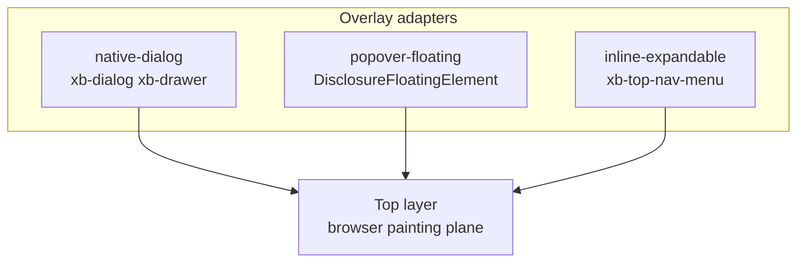

# Three overlay adapters — no unified TopLayer class

XB overlays use three **Overlay adapter** choices at the platform seam, not one shared base class. **Modal** (`xb-dialog`, `xb-drawer`) delegates backdrop and focus trap to native `<dialog showModal>`. **Disclosure** menus (`xb-dropdown`, `xb-select`, `xb-date-picker`) use the popover-floating adapter: `DisclosureFloatingElement` + optional Popover API + `@floating-ui/dom`. **TopNav** flyouts use inline-expandable: hover timers and accordion mode on `xb-top-nav-menu`, not full disclosure dismiss.

We rejected merging **Modal** into `DisclosureFloatingElement` because platform focus traps, `closed-by`, and modal a11y trees differ from Reference + **Panel** popover disclosure. We rejected forcing TopNav onto `DisclosureFloatingElement` because hover-open timing and inline accordion semantics differ from click disclosure.

**Considered:** Shared `ModalElement` base or `TopLayer` controller — shallow pass-through; Dialog and Disclosure already earn keep at their seams after Candidates B and G.

